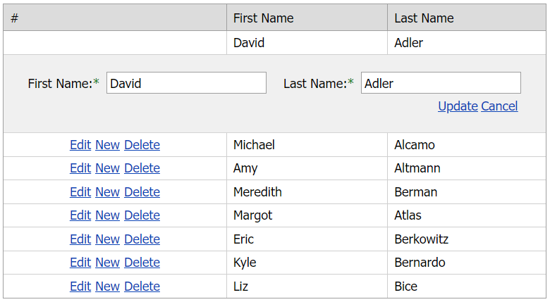

<!-- default badges list -->

[](https://supportcenter.devexpress.com/ticket/details/E5121)
[](https://docs.devexpress.com/GeneralInformation/403183)
<!-- default badges end -->
# Grid View for ASP.NET MVC - How to update data in hidden columns
<!-- run online -->
**[[Run Online]](https://codecentral.devexpress.com/e5121/)**
<!-- run online end -->

This example demonstrates how to configure the grid's edit functionality to update the values of hidden columns.



## Overview

Handle the grid's server-side [CustomJSProperties](https://docs.devexpress.com/AspNetMvc/DevExpress.Web.Mvc.GridViewSettings.CustomJSProperties) event to get the edited row values and pass them to the client.

```cshtml
settings.CustomJSProperties = (sender, e) => {
    MVCxGridView gridView = (MVCxGridView)sender;
    if (gridView.EditingRowVisibleIndex > -1) {
        e.Properties["cpMiddleName"] = gridView.GetRowValues(gridView.EditingRowVisibleIndex, "MiddleName");
    }
};
```

To pass the values from the server to the update action method, handle the grid's client-side [BeginCallback](https://docs.devexpress.com/AspNetMvc/js-MVCxClientGridView.BeginCallback) event.

```cshtml
settings.ClientSideEvents.BeginCallback = "function(s, e) { if(s.cpMiddleName) e.customArgs['MiddleName'] =  s.cpMiddleName; }";
```

## Files to Review

* [HomeController.cs](./CS/Sample/Controllers/HomeController.cs) (VB: [HomeController.vb](./VB/Sample/Controllers/HomeController.vb))
* [GridViewEditingPartial.cshtml](./CS/Sample/Views/Home/GridViewEditingPartial.cshtml)

## Documentation

* [Passing Values to Controller Action Through Callbacks](https://docs.devexpress.com/AspNetMvc/9941/common-features/callback-based-functionality/passing-values-to-a-controller-action-through-callbacks)
